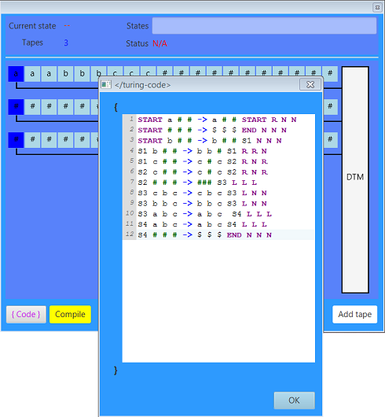

Deterministic Turing Machine Simulator
=========

#### What is this?

A Turing machine is a mathematical model of computation that defines an abstract machine, 
manipulates symbols on a strip of tape to a table of rules. 
(see. [Wikipedia](https://en.wikipedia.org/wiki/Turing_machine))


#### Screenshots



### How Tos

#### Build application with maven

```console
mvn clean install
```

#### Binary file

The latest binary files are on the release section.

#### Run Application

```console
java -jar turingmachine-1.0-SNAPSHOT-uber.jar
```

#### Programming Syntax

STATE INPUT_SYMBOLS -> WRITE_SYMBOLS NEXT_STATE MOVEMENTS  

Example:

```code
S1 a -> b S2 R
```
Explanation: On state `S1` when `a` was read, write `b` and then shift the head to the right and go to state `S2`.

##### Predefined syntax

###### Syntax

| Reserved Syntax   | Meaning                                       |
| ----------------- |:---------------------------------------------:|
| `->`              | Transition to next state                      |
| `#`               | Blank                                         |

###### States

| Reserved states   | Meaning                                       |
| ----------------- |:---------------------------------------------:|
| `START`           | Start state                                   |
| `END`             | End state                                     |

###### Movements

| Head Movement     | Meaning                                            |
| ----------------- |:--------------------------------------------------:|
| `R`               | Shift the head to the right on the next transition |
| `L`               | Shift the head to the left on the next transition  |
| `N`               | Don't shift the head on the next transition        |

#### Code examples 

##### 1 Tape TM

To be processed input: `>aaa###<`

```console
START > -> > S1 R
S1 a -> a S1 R
S1 # -> b S2 R
S2 # -> b S2 R
S2 < -> < END N
```

result: `>aaabbb<`

##### 1 Tape TM

Given a context-free language  

`L(G) = { a^n -> a^2*n | n ∈ ℕ and n ≥ 1 }`  

```console
START a -> § S1 R
S1 a -> a S1 R
S1 # -> b S2 L
S1 b -> b S1 R
S2 b -> b S2 L
S2 § -> § S4 N
S2 a -> a S3 L
S3 a -> a S3 L
S3 § -> § START R
S4 § -> b S4 L
S4 # -> # S5 R
S5 b -> a S5 R
S5 # -> # END N 
```

##### 3 Tape TM

Given a context-sensitive language  
`L(G) = { a^n b^n c^n | n ∈ ℕ and n ≥ 0}`

Code for the decidable of the given language:

```console
START a # # -> a # # START R N N
START # # # -> $ $ $ END N N N
START b # # -> b # # S1 N N N
S1 b # # -> b b # S1 R R N
S1 c # # -> c # c S2 R N R
S2 c # # -> c # c S2 R N R
S2 # # # -> ### S3 L L L
S3 c b c -> c b c S3 L N N
S3 b b c -> b b c S3 L N N
S3 a b c -> a b c  S4 L L L
S4 a b c -> a b c S4 L L L
S4 # # # -> $ $ $ END N N N
```

for input: aaabbbccc -> Accepted!<br>
for input: aabccc -> Declined!  